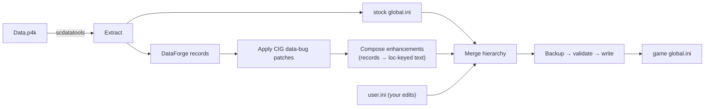

# AerostarLens — Architecture & Design

> **Status: Design draft (v0.1).** This is a living document. Nothing here is locked until we
> agree on it together. Open questions are collected at the bottom.

*See the data the game hides.*

---

## 1. Purpose

AerostarLens is a **standalone Windows desktop tool** that surfaces Star Citizen data the game
already has but never shows you — mission reputation amounts, component stats, blueprint sources,
haul routes — **inside the game's own UI.**

It does this the same way the community-localization system is meant to work: it edits the game's
localization string table (`global.ini`) so the game renders the extra information as native text.

**It is not an overlay, not a mod, and not a memory reader.** It never runs alongside the game and
never touches the game process. It edits one text file that the game reads on load. This is the
CIG-sanctioned localization path (see §13).

---

## 2. Core concept — how the "reveal" works

The game reads every on-screen string from:

```text
{SC install}\{CHANNEL}\data\Localization\english\global.ini
```

Each string has a key like `@item_Desc_QDRV_RSI_S02_Hemera`. The game's own data files
(DataForge, packed inside `Data.p4k`) hold the *numbers* behind those items — a mission's
reputation reward, a shield's HP, a quantum drive's speed — but the vanilla UI doesn't print them.

AerostarLens:

1. Reads those numbers straight out of `Data.p4k`.
2. **Appends** them to the matching description strings.
3. Writes the merged `global.ini` back to the game install.

The game then draws its own (now-enriched) text. The values are **static per game patch** — a
snapshot of the data files, not a live account readout — and refresh when you re-extract after an
update.

---

## 3. The pipeline



Five stages: **Extract → Patch → Compose → Merge → Apply.** Stages 1–3 are data prep (run on demand
after a game patch); Merge + Apply run every time you hit "Apply."

---

## 4. Where AerostarLens sits in the Aerostar ecosystem

| Project | Role | Relationship to Lens |
| --- | --- | --- |
| **AerostarCodex** (sibling) | Internal extraction/upload console (pywebview + `scdatatools`) that feeds the web app | Lens **reuses its proven extraction approach** (`scdatatools` → `global.ini` + DataForge). Codex stays the internal ops tool; Lens is the user-facing product. |
| **AerostarGroupPrime** (web app) | React platform (Forge, Atlas, Suite, AGeX) | **Optional, deferred** sync target. Lens can later push/pull enhancement data via the same Supabase pipeline Codex already uses. Not required for local use. |
| **`_refs/`** (external) | Read-only clones of third-party community localization tools (Apache-2.0) | Prior art only. We keep the hard-won **safety rails** (§9) and avoid their documented landmines. We do **not** fork them — different stack. |

**Boundary rule:** Lens is self-contained and runs fully offline. Web-app integration is an
opt-in feature, never a dependency.

---

## 5. Tech stack

| Layer | Choice | Why |
| --- | --- | --- |
| **Core engine** | Python 3.11+ | Reuses AerostarCodex's `scdatatools` extraction — proven on the p4k/DataForge/INI work. |
| **Desktop shell** | `pywebview` (native window → local web UI) | Same pattern AerostarCodex already ships as an `.exe`. Lets us build the UI in web tech instead of desktop widgets. |
| **UI** | React + Vite + Tailwind, in the AerostarGroupPrime **liquid-glass** design language | We reuse the design system and the skills you already have. |
| **UI ↔ core bridge** | Local HTTP API (FastAPI/`http.server`) **or** pywebview `js_api` | TBD — see open questions. Codex uses a local `http.server`; we may lift it. |
| **Packaging** | PyInstaller (or Codex's C# launcher trick) → `AerostarLens.exe` | Single distributable, no console flash. |

**Rejected:** PyQt6 — heavier, desktop-only widgets, and it throws away
your React/Tailwind investment.

---

## 6. Repository layout (planned)

```text
AerostarLens/
├── ARCHITECTURE.md            # this document
├── README.md
├── VERSION.txt
├── requirements.txt           # Python deps
├── .gitignore
├── app.py                     # pywebview entry — opens the native window
│
├── core/                      # the engine (pure Python, UI-agnostic, testable)
│   ├── extract/               # Data.p4k → global.ini + DataForge records (scdatatools)
│   ├── compose/               # DataForge records → loc-keyed enhancement text
│   │   ├── missions.py        #   rep rewards, XP tracks, routes   ← FIRST MILESTONE
│   │   ├── ships.py
│   │   ├── components.py
│   │   └── weapons.py
│   ├── merge/                 # source-hierarchy merge engine
│   ├── ini/                   # INI parse / read / write (encoding-tolerant)
│   ├── apply/                 # backup → validate → write global.ini, rollback
│   ├── patches/               # declarative JSON fixes for CIG data bugs
│   ├── channels.py            # LIVE/PTU/EPTU/HOTFIX/TECH-PREVIEW isolation + paths
│   └── settings.py            # config, user-data paths, per-channel resolution
│
├── server/                    # local API bridging UI ↔ core
│
├── ui/                        # React + Vite + Tailwind (liquid glass) → built to static
│   └── src/
│
└── tests/                     # pytest — core is covered first, UI later
```

**Layer rule:** `core/` never imports from `server/` or `ui/`. The engine is a library you could
run headless from a script. The server is a thin adapter; the UI is a client.

---

## 7. Core engine layers

- **`extract/`** — opens `Data.p4k` via `scdatatools`, pulls the stock `global.ini`, and extracts
  the DataForge record sets we need (contracts/missions, entities, crafting, mining, manufacturers…).
  Mirrors what AerostarCodex already does.
- **`compose/`** — the heart of the tool. Walks DataForge records and emits enhancement lines keyed
  by loc-key (`@key = <stock text><appended data block>`). One module per category.
- **`merge/`** — layers sources in a user-defined hierarchy (see §8).
- **`ini/`** — line-oriented parse/write that tolerates non-UTF-8 and preserves exact bytes for
  user edits (a favorite marker can be a single space — stripping it would drop the favorite).
- **`apply/`** — the guarded write (see §9).
- **`patches/`** — idempotent JSON patches applied to extracted DataForge to fix known CIG data bugs
  before composing.

---

## 8. Data & merge model

**Merge hierarchy** (later wins; your edits always last):

```text
stock global.ini  →  enhancements  →  user.ini
    (base)            (generated)      (your overrides — survive game patches)
```

- **`StringEntry`** — the domain model per string: `key`, `stock_value`, `enhanced_value`,
  `user_value`, `status` (Unmodified / Enhanced / Modified / New), `category`.
- **Enhancement INIs** — one file per category, cached per channel, regenerated only when their
  DataForge inputs changed (a diff-cache).
- **`user.ini`** — your manual edits, per channel, applied last so a game update never clobbers them.

**⚠️ Key-variant landmine (documented in prior community tools):** SC has near-duplicate keys
(`item_Name_QDRV…` vs `item_nameQDRV…_SCItem`). Syncing values across them is useful **but must be
scoped narrowly to the `item_Name*`/`item_Desc*` namespace.** Run table-wide it collides unrelated
keys (`Stanton2` the planet vs `Stanton_2` the star) and corrupts shipped
text. We scope from day one and cover it with a test.

---

## 9. Safety rails (non-negotiable)

These are hard-won lessons from prior community tooling — we do **not** cut them:

1. **Backup → validate → auto-rollback on every apply.** Take a timestamped backup of `global.ini`
   first. After writing, validate the output against the stock key set. On any mismatch, roll back
   automatically. Corrupting `global.ini` breaks the game's text everywhere.
2. **Per-channel isolation.** LIVE / PTU / EPTU / HOTFIX / TECH-PREVIEW each get their own
   `user.ini`, cache, and backups. No cross-bleed.
3. **User overrides survive updates.** `user.ini` is applied last and persists across game patches.
4. **Declarative CIG patches** are idempotent and applied at extract time, not hand-edited into data.
5. **Rotating backups.** Cap at N (default 5); one-click restore from any.
6. **Localization text only.** We never modify anything but localization strings (see §13).

---

## 10. Enhancement categories

Each category is a `compose/` module that turns records into loc-keyed text. Priority order:

| Category | Source records | Surfaces |
| --- | --- | --- |
| **Mission rewards** ← *first* | contracts / missiondata / missionbroker | reputation amount + track, XP, payout, haul route |
| Ship specs | entities.spaceships | flight/handling/dimensions blocks |
| Components | entities.scitems (SHLD/POWR/COOL/QDRV) | shield HP, power, cooling, QD speed |
| Ship weapons | entities.scitems | DPS, damage, fire rate |
| FPS weapons | entities.scitems | damage, RoF, ammo |
| Blueprint tags | crafting / lootgeneration | `[BP]` reward tags + owned tracking |
| Commodity crafting | crafting | recipe cross-references |

**Format conventions (to finalize):** appended blocks sit below the stock description, use SC's
loc-tokens for line breaks/emphasis so the in-game render is clean, and are individually togglable
per category. A **live preview** in the UI renders loc-tokens to styled HTML so you see the in-game
result before applying.

---

## 11. UI design

- **Shell:** a single native window (pywebview) — no browser.
- **Look:** AerostarGroupPrime's liquid-glass system — translucent surfaces, backdrop-blur,
  square corners, per-accent glow. Consistent with the rest of the Aerostar suite.
- **Primary views:**
  - **String table** — searchable/filterable, category filter, per-column filters, inline edit of the
    custom value, live preview pane.
  - **Enhancements** — per-category toggles, tag/format config.
  - **Blueprint Tracker** — mark owned blueprints (later; can scan game logs to auto-populate).
  - **Config** — channel, SC install path, data folder, theme.
  - **Simple mode** — one button: extract → compose → apply, for non-power-users.

---

## 12. Channels & filesystem paths

**Game file we write:**

```text
{SC root}\{CHANNEL}\data\Localization\english\global.ini
```

**Our per-user data:**

```text
%USERPROFILE%\Documents\AerostarLens\{CHANNEL}\
  ├── user.ini            # your edits
  ├── cache\              # base.ini (stock) + *_enhancements.ini
  └── backups\            # rotating global.ini backups (max N)

%LOCALAPPDATA%\AerostarLens\{CHANNEL}\cache\dataforge\   # extracted XML (large — off OneDrive)
```

Channel switching never restarts the app; it repoints all paths.

---

## 13. Compliance & legal

- **CIG-sanctioned path.** Customizing localization via extracted `global.ini` is authorized by CIG
  to support community translation (RSI, 2023-10-11). We stay strictly inside it.
- **Localization text only.** No gameplay, no binaries, no memory, no network interception.
- **Never redistribute game data.** Extracted `global.ini`, DataForge, and `Data.p4k` contents are
  CIG-owned and are **git-ignored** — they live only on the user's machine, pulled from *their* game
  install.
- **Unofficial fan project.** Not affiliated with CIG. License TBD (Apache-2.0 candidate).

---

## 14. What sets AerostarLens apart

| Area | Typical community tools | AerostarLens |
| --- | --- | --- |
| UI | desktop-widget toolkits | React + Tailwind liquid-glass (your stack) |
| Data derivations | built from scratch | reuse Aerostar `SCData` / blueprint sources / mission taxonomy where possible |
| Composer reuse | desktop-only | one composer that can later feed the web app too |
| Enhancement depth | game data only | can layer org cross-refs / AGeX values (opt-in, later) |

We **keep** the proven safety model and merge correctness — that's not where we differentiate.

---

## 15. Roadmap

- **M1 — Vertical slice (proves the whole chain):** extract → compose **mission reputation rewards**
  → merge `[global, enhancements]` → **backup + write + validate** → minimal UI (pick channel, toggle
  the enhancement, Apply, Restore). Round-trips safely in-game.
- **M2 — Editable string table** with search/filter, inline edit, `user.ini` persistence, live preview.
- **M3 — More categories** (ship specs, components, weapons) + per-category toggles + tag config.
- **M4 — Blueprint Tracker** + game-log ownership scan.
- **M5 — Packaging** (`AerostarLens.exe`, installer, auto-update, backups/restore polish).
- **M6 — Optional web-app sync** via the existing Supabase pipeline.

---

## 16. Open questions (let's resolve these together)

1. **UI ↔ core bridge:** local HTTP API (lift Codex's `server.py`) or pywebview `js_api`?
2. **`scdatatools` (Codex's approach) vs an `unp4k`/`unforge` toolchain** for extraction —
   do we standardize on `scdatatools`?
3. **Enhancement text format:** exact block layout, above/below stock text, which loc-tokens.
4. **Data-folder location:** Documents vs LocalAppData for the user data root.
5. **License** for the repo (Apache-2.0?).
6. **GitHub remote:** local-only for now, or create/authorize a remote to push to?
